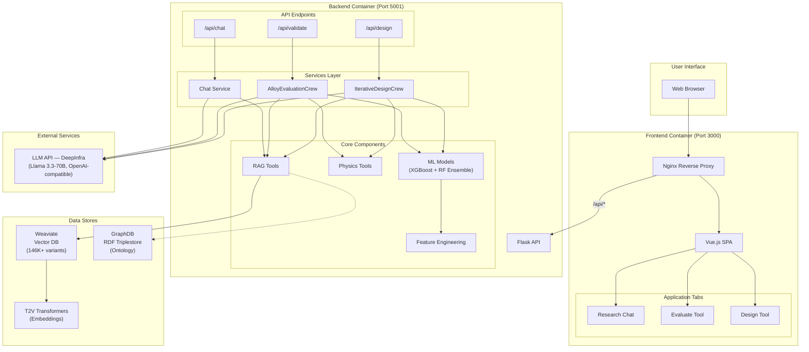
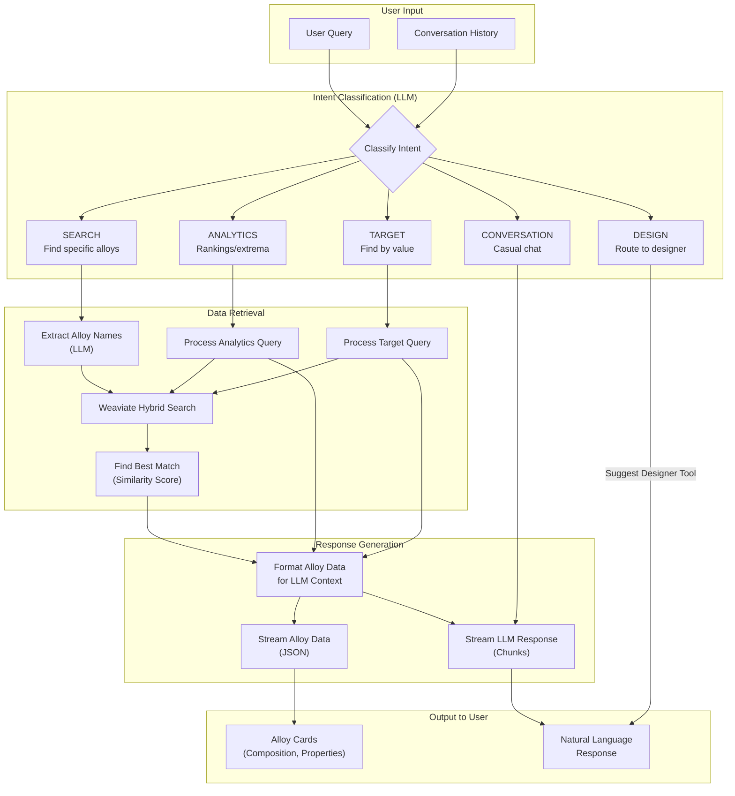
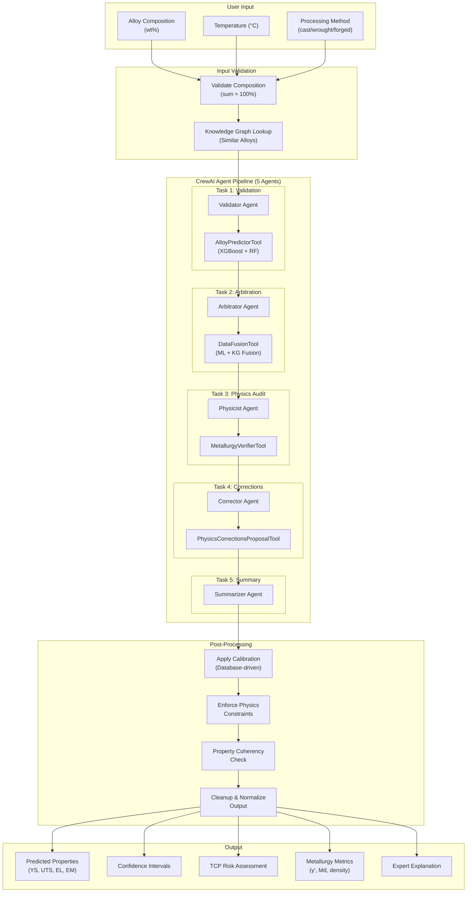
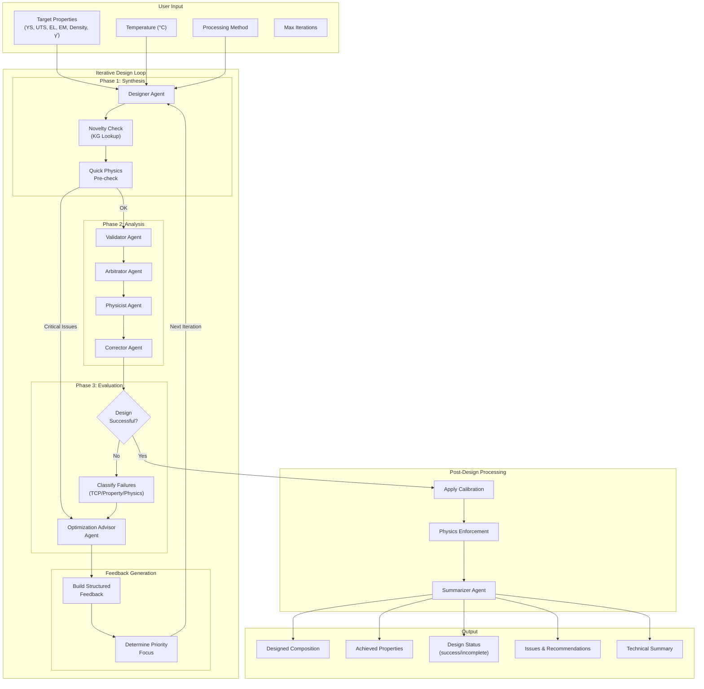
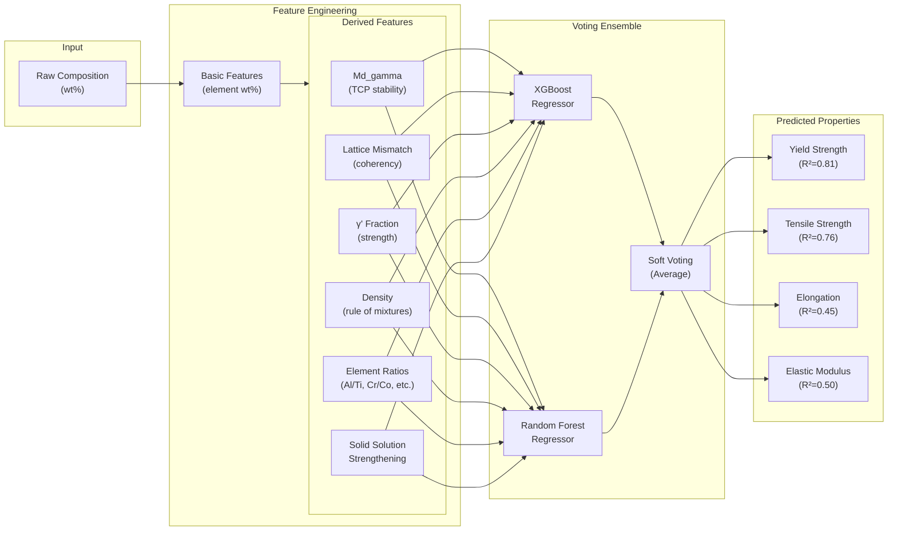
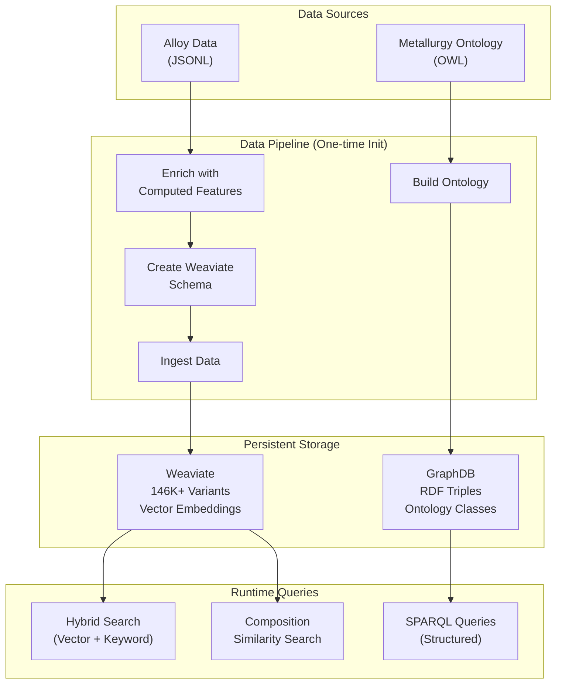
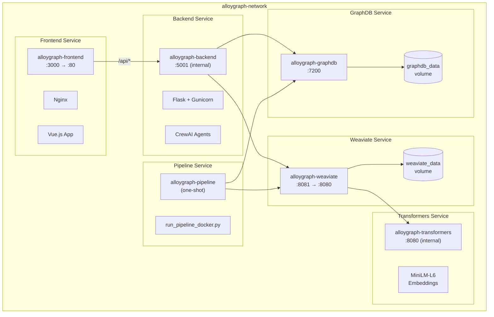

# AlloyGraph Architecture Documentation

## 1. High-Level System Architecture

## 2. Chat RAG Application Flow

## 3. Evaluation Tool Flow (Composition → Properties)

## 4. Design Tool Flow (Properties → Composition)

## 5. ML Model Architecture

## 6. Data Flow Overview

## 7. Docker Services Architecture

---

## Summary Table

| Component | Technology | Purpose |
|-----------|------------|---------|
| Frontend | Vue.js 3 + Nginx | User interface with 3 tabs |
| Backend API | Flask + Gunicorn | REST API endpoints |
| Agent Framework | CrewAI | Multi-agent orchestration |
| ML Models | XGBoost + Random Forest | Property prediction |
| Vector DB | Weaviate | Semantic search (146K+ variants) |
| Graph DB | GraphDB | RDF triplestore (ontology) |
| Embeddings | MiniLM-L6 | Text-to-vector conversion |
| LLM | Llama 3.3-70B via any OpenAI-compatible provider (currently DeepInfra) | Intent classification, response generation |

## Key Data Flows

1. **Chat RAG**: Query → Intent Classification → Weaviate Search → LLM Response
2. **Evaluation**: Composition → ML Prediction → KG Fusion → Physics Audit → Calibration
3. **Design**: Targets → Designer Agent → Validation Loop → Optimization → Final Composition
