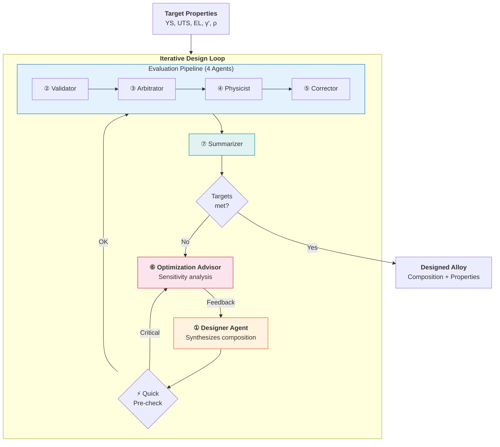

# Design Pipeline - Agent Workflow

## Overview

The Design Pipeline is an **inverse problem**: given target properties, design an alloy composition. It uses **7 agents** in an iterative loop until targets are met or max iterations reached.

## Mermaid Diagram - Full Detail

```mermaid
flowchart TB
    classDef input fill:#e1f5fe,stroke:#01579b,stroke-width:2px
    classDef agent fill:#fff3e0,stroke:#e65100,stroke-width:2px
    classDef tool fill:#f3e5f5,stroke:#7b1fa2,stroke-width:1px
    classDef decision fill:#ffebee,stroke:#c62828,stroke-width:2px
    classDef output fill:#e8f5e9,stroke:#2e7d32,stroke-width:2px
    classDef feedback fill:#fff9c4,stroke:#f9a825,stroke-width:2px
    classDef precheck fill:#e0f7fa,stroke:#00838f,stroke-width:2px

    %% Input
    Input["📥 <b>TARGET PROPERTIES</b><br/>─────────────────<br/>Yield Strength (MPa)<br/>Tensile Strength (MPa)<br/>Elongation (%)<br/>γ' fraction (%)<br/>Density (g/cm³)"]:::input

    %% Designer Agent
    subgraph Designer["🎨 AGENT 1: Designer"]
        D1["<b>Role:</b> Principal Synthesis Architect"]
        D2["<b>Tool:</b> None (LLM reasoning)"]:::tool
        D3["<b>Generates:</b><br/>• Novel composition (wt%)<br/>• Element selection strategy<br/>• Processing route"]
    end

    %% Quick Physics Pre-check (Function, not agent)
    QuickCheck{"⚡ <b>Quick Pre-check</b><br/>───────────────<br/>• Md_gamma > 0.97?<br/>• |δ| > 0.9%?<br/>• Cr outside 5-20%?"}:::precheck

    %% Evaluation Sub-pipeline (4 agents)
    subgraph Evaluation["📊 EVALUATION PIPELINE (4 Agents)"]
        direction TB
        EV["② <b>Validator</b><br/>AlloyPredictorTool<br/>→ ML predictions"]
        EA["③ <b>Arbitrator</b><br/>DataFusionTool<br/>→ ML + KG fusion"]
        EP["④ <b>Physicist</b><br/>MetallurgyVerifierTool<br/>→ TCP risk, penalty"]
        EC["⑤ <b>Corrector</b><br/>PhysicsCorrectionsTool<br/>→ Adjusted values"]

        EV --> EA --> EP --> EC
    end

    %% Summarizer (runs every iteration after evaluation)
    subgraph Summarizer["📝 AGENT 7: Summarizer"]
        S1["<b>Role:</b> Materials Science Communicator"]
        S2["<b>Generates:</b><br/>• Design rationale<br/>• Performance summary<br/>• Application recommendations"]
    end

    %% Success Check
    Success{"Targets<br/>Met?"}:::decision

    %% Optimization Advisor
    subgraph Optimizer["🔧 AGENT 6: Optimization Advisor"]
        O1["<b>Role:</b> Compositional Optimization Specialist"]
        O2["<b>Tool:</b> AlloyOptimizationAdvisor"]:::tool
        O3["<b>Computes:</b><br/>• Sensitivity: ∂Md/∂Re, ∂γ'/∂Al<br/>• Ranked suggestions<br/>• Trade-off quantification"]
    end

    %% Feedback
    Feedback["📋 <b>STRUCTURED FEEDBACK</b><br/>─────────────────<br/>Priority 1: Reduce Re 6%→4.5%<br/>Priority 2: Increase Al 5%→6.5%<br/>Priority 3: Adjust Ti for mismatch"]:::feedback

    %% Output
    Output["📤 <b>DESIGNED ALLOY</b><br/>─────────────────<br/>Final Composition (wt%)<br/>Predicted Properties<br/>Confidence Assessment<br/>Expert Summary"]:::output

    Incomplete["⚠️ <b>MAX ITERATIONS</b><br/>─────────────────<br/>Best attempt returned<br/>Issues documented"]:::decision

    %% Main Flow
    Input --> Designer
    Designer --> QuickCheck

    %% Pre-check paths
    QuickCheck -->|"Critical Issues<br/>(skip evaluation)"| Optimizer
    QuickCheck -->|"OK"| Evaluation

    %% Evaluation to Summarizer (runs every iteration)
    Evaluation --> Summarizer
    Summarizer --> Success

    %% Success paths
    Success -->|"Yes"| Output
    Success -->|"No"| Optimizer

    %% Feedback loop
    Optimizer --> Feedback
    Feedback -->|"Iteration < Max"| Designer
    Feedback -->|"Max Reached"| Incomplete

    %% Styling
    style Designer fill:#fff3e0,stroke:#e65100,stroke-width:2px
    style Evaluation fill:#e3f2fd,stroke:#1565c0,stroke-width:2px
    style Optimizer fill:#fce4ec,stroke:#c2185b,stroke-width:2px
    style Summarizer fill:#e0f2f1,stroke:#00897b,stroke-width:2px
```



---

## Paper Version (Simplified)



---

## Agent Interaction Matrix

| Agent | Receives From | Sends To | Key Decision |
|-------|---------------|----------|--------------|
| **① Designer** | Targets OR Advisor feedback | Quick Pre-check | Composition synthesis |
| **② Validator** | Composition | Arbitrator | ML predictions (XGBoost + RF) |
| **③ Arbitrator** | ML predictions | Physicist | ML + KG fusion, confidence |
| **④ Physicist** | Fused predictions | Corrector | TCP risk, penalty score |
| **⑤ Corrector** | Predictions + violations | Summarizer | Physics corrections |
| **⑥ Advisor** | Failed evaluation OR pre-check | Designer (feedback) | Sensitivity-based suggestions |
| **⑦ Summarizer** | Corrected properties | Success check | Expert explanation |

---

## Tool Summary Table

| Agent | Tool | Input | Output |
|-------|------|-------|--------|
| Designer | None (LLM) | Targets + feedback | Composition (wt%) |
| Validator | AlloyPredictorTool | Composition | YS, UTS, EL, EM, γ', ρ, Md |
| Arbitrator | DataFusionTool | ML predictions | Fused values + confidence |
| Physicist | MetallurgyVerifierTool | Fused predictions | Penalty score, TCP risk |
| Corrector | PhysicsCorrectionsTool | Predictions + violations | Corrected values |
| Advisor | AlloyOptimizationAdvisor | Failed comp + targets | Ranked suggestions |
| Summarizer | None (LLM) | All data | Human explanation |

---

## How the Optimization Advisor Works

The `AlloyOptimizationAdvisor` calculates **physics-based sensitivities** using finite differences:

```
∂Md/∂Element = Md(comp + 1% element) - Md(comp)
∂γ'/∂Element = γ'(comp + 1% element) - γ'(comp)
```

### Suggestion Groups:

| Issue | Priority | Action |
|-------|----------|--------|
| **TCP Risk (Md > 1.0)** | CRITICAL | Reduce Re/Mo/W/Ta, increase Cr/Co |
| **Low Yield Strength** | HIGH | Increase Al/Ti/Ta or Mo/W |
| **γ' Too High** | CRITICAL | Reduce Al/Ti/Ta |

### Example Suggestion:
```json
{
  "element": "Re",
  "current_wt": 6.0,
  "suggested_wt": 4.5,
  "reason": "Reduce Re to lower Md",
  "expected_md_change": -0.023,
  "trade_offs": "May reduce creep resistance"
}
```

---

## Quick Physics Pre-check

**Purpose**: Catch critical issues BEFORE running the expensive evaluation pipeline.

**Checks performed** (function at `alloy_designer.py:53-89`):
- `Md_gamma > 0.97` → Critical TCP risk
- `|δ| > 0.9%` → Coherency loss risk
- `Cr < 5% or > 20%` → Outside optimal range
- `Al+Ti+Ta < 3% or > 12%` → γ' former bounds

**If critical issues found** → Skip evaluation, go directly to Optimizer for quick fixes.

---

## Iteration Example

```
ITERATION 1:
  Designer → Target YS=1200 MPa → proposes Re=6%, Al=5.5%
  Quick Pre-check → Md_gamma = 0.98 > 0.97 → CRITICAL!
  ⚡ Skip evaluation, go to Optimizer
  Optimizer → "Reduce Re to 4.5% (∂Md/∂Re = -0.015)"
  Feedback → Designer

ITERATION 2:
  Designer → Adjusts: Re=4.5%, Al=6.0%
  Quick Pre-check → Md_gamma = 0.94 → OK ✓
  Evaluation runs:
    Validator → YS = 1180 MPa
    Arbitrator → Fused YS = 1190 MPa (KG match found)
    Physicist → TCP Risk = LOW, Penalty = 12
    Corrector → No corrections needed
  Summarizer → Generates explanation
  Success? → YS 1190 < 1200 → NO
  Optimizer → "Increase Al to 6.5% for +35 MPa"
  Feedback → Designer

ITERATION 3:
  Designer → Al=6.5%, Ti=1.2%
  Quick Pre-check → OK ✓
  Evaluation → YS = 1215 MPa, TCP = Low
  Summarizer → Final report
  Success? → YS 1215 ≥ 1200 → YES ✓

OUTPUT:
  Composition: Ni-6.5Al-1.2Ti-4.5Re-6W-9Co-6.5Cr...
  YS: 1215 MPa, TCP: Low, Confidence: HIGH
```

---

## Priority Mode

Once YS target is met but TCP is still high, the system enters **Priority Mode**:

```python
if ys_target_met and tcp_critical:
    # Focus ONLY on TCP risk
    # Accept slight YS reduction to eliminate TCP
```

This prevents over-engineering and ensures TCP safety is prioritized.
