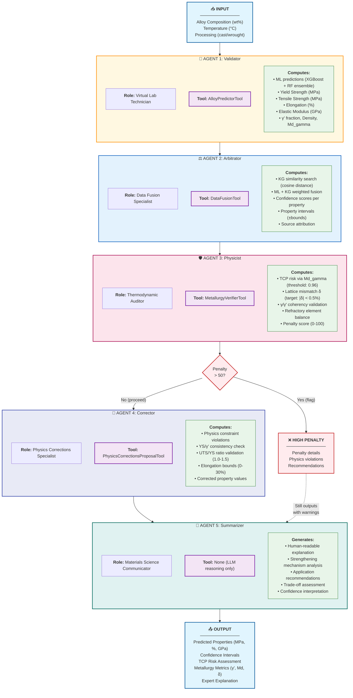
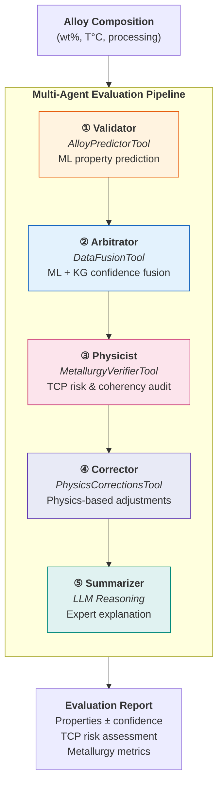

# Evaluation Pipeline - Agent Workflow

## Overview

The Evaluation Pipeline takes an alloy composition and predicts its mechanical properties through a **5-agent sequential workflow**. Each agent has a specific role, tool, and responsibility in the validation chain.

## Mermaid Diagram - Full Detail



---

## Paper Version (Simplified)



---

## Agent Interaction Matrix

| Agent | Receives From | Sends To | Key Decision |
|-------|---------------|----------|--------------|
| **① Validator** | User composition | Arbitrator | Run ML ensemble |
| **② Arbitrator** | ML predictions | Physicist | Blend with KG data |
| **③ Physicist** | Fused predictions | Corrector OR Penalty | Physics validation |
| **④ Corrector** | Predictions + violations | Summarizer | Apply corrections |
| **⑤ Summarizer** | All pipeline data | User | Generate explanation |

---

## Tool Summary Table

| Agent | Tool | Input | Output |
|-------|------|-------|--------|
| Validator | AlloyPredictorTool | Composition (wt%) | YS, UTS, EL, EM, γ', ρ, Md |
| Arbitrator | DataFusionTool | ML predictions | Fused values + confidence |
| Physicist | MetallurgyVerifierTool | Fused predictions | Penalty score, TCP risk |
| Corrector | PhysicsCorrectionsTool | Predictions + violations | Corrected values |
| Summarizer | (LLM only) | All data | Human explanation |

---

## Evaluation Example

```
Input: CMSX-4 composition
  Ni: 61.7%, Cr: 6.5%, Co: 9.0%, Mo: 0.6%, W: 6.0%
  Al: 5.6%, Ti: 1.0%, Ta: 6.5%, Re: 3.0%, Hf: 0.1%
  Temperature: 850°C, Processing: cast

① Validator (AlloyPredictorTool):
   ML Predictions:
   • YS = 1180 MPa (XGBoost: 1195, RF: 1165)
   • UTS = 1420 MPa
   • EL = 8.2%
   • γ' = 68.5 vol%
   • Md_gamma = 0.92

② Arbitrator (DataFusionTool):
   KG Match: "CMSX-4" (distance: 0.002 → 98% KG weight)
   Fused Values:
   • YS = 1190 MPa ± 45 (confidence: HIGH)
   • UTS = 1410 MPa ± 60 (confidence: HIGH)
   • Source: 98% KG, 2% ML

③ Physicist (MetallurgyVerifierTool):
   TCP Risk: Md_gamma = 0.92 → LOW RISK ✓
   Lattice Mismatch: δ = 0.35% → OPTIMAL ✓
   Coherency: γ' = 68.5% consistent with YS ✓
   Penalty Score: 12/100 (PASS)

④ Corrector (PhysicsCorrectionsTool):
   No corrections needed (penalty < 50)
   UTS/YS ratio = 1.19 → VALID ✓
   Elongation = 8.2% → VALID ✓

⑤ Summarizer (LLM):
   "CMSX-4 exhibits excellent high-temperature strength due to
    its high γ' volume fraction (~68%) and optimal lattice mismatch.
    The low Md_gamma (0.92) indicates good TCP phase stability,
    making it suitable for single-crystal turbine blade applications."

Output:
  ┌─────────────────────────────────────┐
  │ YS:  1190 ± 45 MPa   (HIGH conf.)   │
  │ UTS: 1410 ± 60 MPa   (HIGH conf.)   │
  │ EL:  8.2 ± 1.5%      (MED conf.)    │
  │ γ':  68.5 vol%                      │
  │ TCP: LOW RISK (Md=0.92)             │
  └─────────────────────────────────────┘
```

---

## Agent Details

### Agent 1: Validator (Virtual Lab Technician)
- **Purpose**: Run ML models on the input composition
- **Tool**: `AlloyPredictorTool`
- **Input**: Composition, temperature, processing method
- **Output**: Raw ML predictions for all properties
- **Models**: XGBoost + Random Forest ensemble

### Agent 2: Arbitrator (Data Fusion Specialist)
- **Purpose**: Blend ML predictions with Knowledge Graph data
- **Tool**: `DataFusionTool`
- **Logic**:
  - Searches KG for similar alloys (cosine distance)
  - Weights ML vs KG based on compositional similarity:
    - Close match (distance < 0.01) → Trust KG 99%
    - Moderate match (0.01-0.1) → Weighted blend
    - No match (distance > 0.1) → Trust ML 100%
- **Output**: Fused predictions with confidence scores

### Agent 3: Physicist (Thermodynamic Auditor)
- **Purpose**: Validate physics constraints
- **Tool**: `MetallurgyVerifierTool`
- **Checks**:
  - TCP phase stability: Md_gamma < 0.96 (preferred)
  - Lattice mismatch: |δ| < 0.5% (optimal coherency)
  - Property coherency: YS correlates with γ'
  - Density vs refractory content
- **Output**: Penalty score (0-100), warnings, or REJECTION

### Agent 4: Corrector (Physics Corrections Specialist)
- **Purpose**: Apply physics-based corrections when needed
- **Tool**: `PhysicsCorrectionsProposalTool`
- **Logic**:
  - Low confidence + physics violation → Apply correction
  - High confidence + KG match → Trust data
  - Validates: UTS/YS ratio (1.0-1.5), Elongation bounds
- **Output**: Corrected properties with explanations

### Agent 5: Summarizer (Materials Science Communicator)
- **Purpose**: Generate human-readable explanation
- **Tool**: None (LLM reasoning only)
- **Covers**:
  - Strengthening mechanisms
  - Application suitability
  - Trade-off analysis
  - Confidence interpretation
- **Output**: 3-paragraph expert summary
