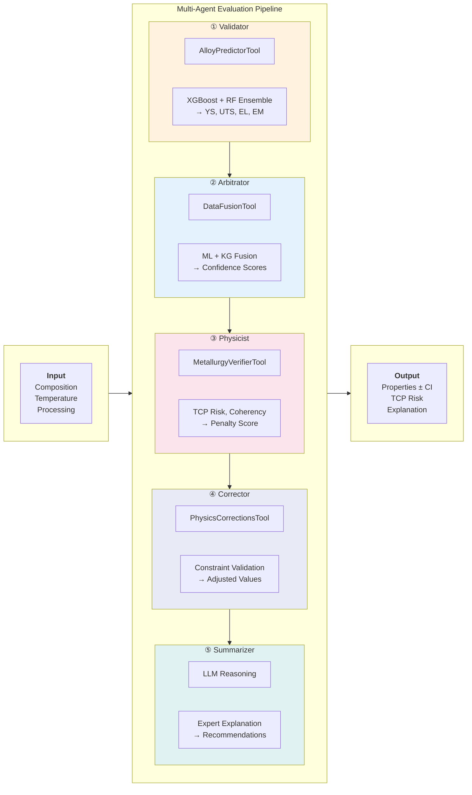
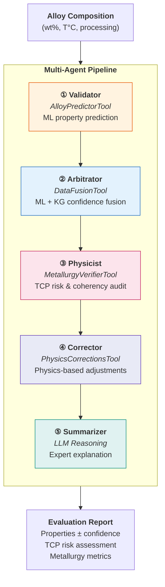

# Evaluation Pipeline - Paper Version

A cleaner diagram suitable for publication.

---

## Alternative: Vertical Flow (Better for Papers)

---

## Tool Summary Table

| Agent | Tool | Input | Output |
|-------|------|-------|--------|
| Validator | AlloyPredictorTool | Composition | YS, UTS, EL, EM, γ', ρ, Md |
| Arbitrator | DataFusionTool | ML predictions + KG | Fused values + confidence |
| Physicist | MetallurgyVerifierTool | Fused predictions | Penalty score, TCP risk |
| Corrector | PhysicsCorrectionsTool | Predictions + violations | Corrected values |
| Summarizer | (LLM only) | All data | Human explanation |
