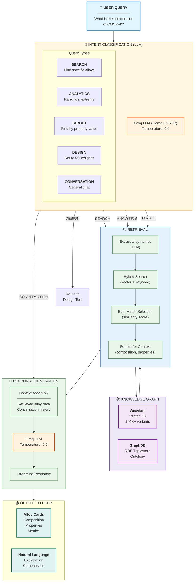
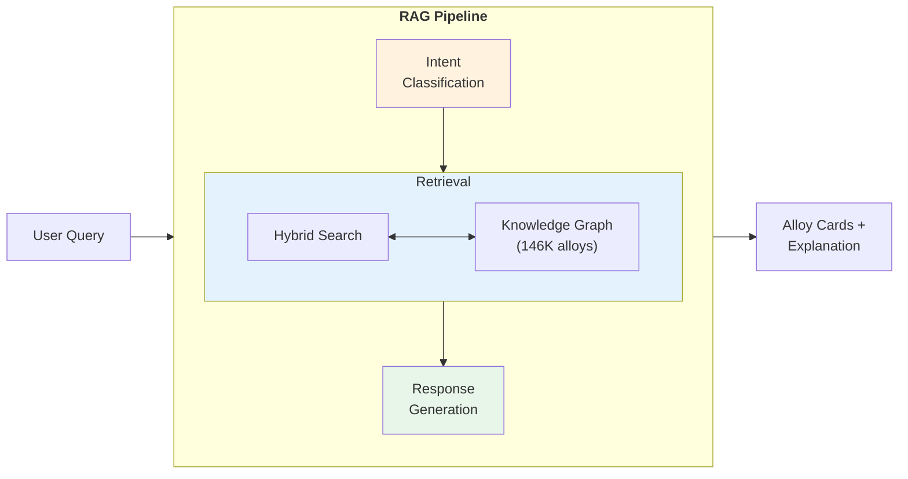

# RAG Chat System - Research Assistant

## Overview

The RAG (Retrieval-Augmented Generation) chat system allows users to query the alloy knowledge base using natural language. It uses intent classification to route queries appropriately.

## Mermaid Diagram - Full Detail



---

## Paper Version (Simplified)



---

## Intent Types & Examples

| Intent | Example Query | Action |
|--------|---------------|--------|
| **SEARCH** | "What is CMSX-4?" | Find specific alloy in KG |
| **ANALYTICS** | "Which alloy has highest YS?" | Rank alloys by property |
| **TARGET** | "Find alloys with YS > 1000 MPa" | Filter by property value |
| **DESIGN** | "Design an alloy for turbine blades" | Route to Design Pipeline |
| **CONVERSATION** | "What is gamma prime?" | General LLM response |

## Data Flow Example

```
User: "What is the composition of CMSX-4?"
    ↓
Intent Classification → SEARCH
    ↓
Extract alloy name → "CMSX-4"
    ↓
Weaviate hybrid search → Find best match
    ↓
Retrieve: composition, properties, metrics
    ↓
Format context for LLM
    ↓
Generate response with alloy card
    ↓
User sees: Composition table + explanation
```
