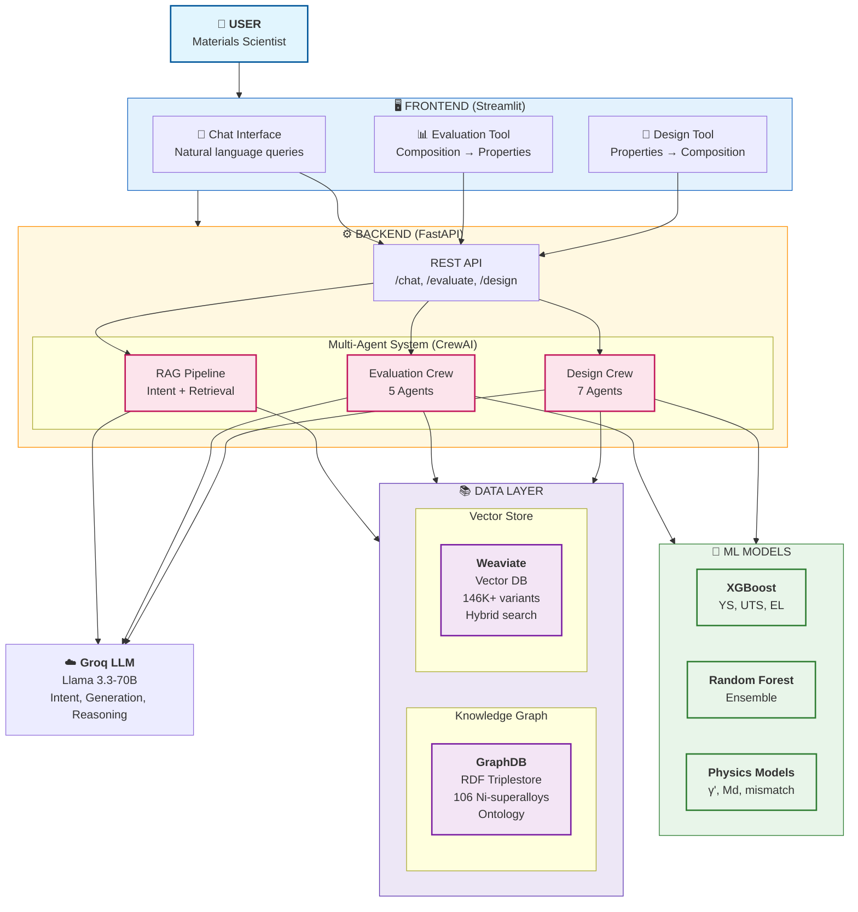
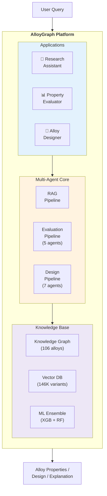
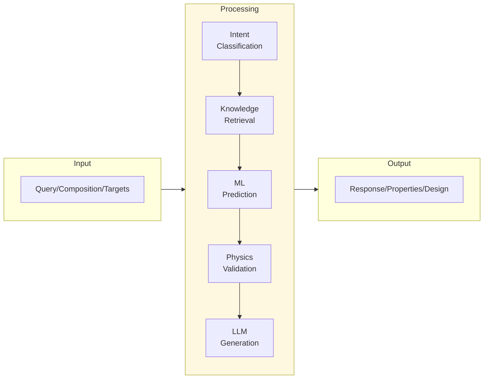

# AlloyGraph System Overview

## Overview

AlloyGraph is a multi-agent AI platform for Ni-based superalloy research. It combines a Knowledge Graph (106 alloys), Vector Database (146K+ variants), ML models, and LLM agents to provide three main applications.

## Mermaid Diagram - Full System Architecture



---

## Paper Version (Simplified)



---

## Component Summary

| Layer | Component | Technology | Purpose |
|-------|-----------|------------|---------|
| **Frontend** | Chat UI | Streamlit | Natural language queries |
| | Evaluation UI | Streamlit | Composition input & results |
| | Design UI | Streamlit | Target properties input |
| **Backend** | API | FastAPI | REST endpoints |
| | Agents | CrewAI | Multi-agent orchestration |
| **Data** | Knowledge Graph | GraphDB | RDF ontology, 106 alloys |
| | Vector Store | Weaviate | 146K variants, hybrid search |
| **ML** | Property Models | XGBoost + RF | YS, UTS, EL, EM prediction |
| | Physics Models | Python | γ', Md, lattice mismatch |
| **LLM** | Generation | Groq (Llama 3.3) | Intent, reasoning, summaries |

---

## Three Applications

### 1. Research Assistant (RAG Chat)
```
User Query → Intent Classification → Knowledge Retrieval → Response Generation
```
- Answer questions about alloys
- Compare compositions
- Explain metallurgical concepts

### 2. Property Evaluator
```
Composition → 5-Agent Pipeline → Predicted Properties + Confidence
```
- Predict mechanical properties (YS, UTS, EL)
- Calculate metallurgical metrics (γ', Md, TCP risk)
- Physics-based validation

### 3. Alloy Designer
```
Target Properties → 7-Agent Iterative Loop → Optimized Composition
```
- Inverse design problem
- Iterative refinement with feedback
- Physics-constrained optimization

---

## Data Flow Architecture



---

## Technology Stack

| Category | Technologies |
|----------|-------------|
| **Frontend** | Streamlit, Python |
| **Backend** | FastAPI, CrewAI, LangChain |
| **Databases** | GraphDB (RDF), Weaviate (Vector) |
| **ML** | XGBoost, Random Forest, scikit-learn |
| **LLM** | Groq API (Llama 3.3-70B) |
| **Physics** | Custom metallurgy models |
| **Deployment** | Docker, Docker Compose |
